<p align="center">
  
</p>

<h1 align="center">Pool Pilot Dashboard</h1>

<p align="center">
  Carte Lovelace complète et mobile pour l’intégration Pool Pilot dans Home Assistant.
</p>

<p align="center">
  <a href="https://github.com/amery74/pool-pilot-dashboard/releases"></a>
  <a href="LICENSE"></a>
  <a href="https://github.com/amery74/pool-pilot-dashboard/actions/workflows/validate.yml"></a>
  <a href="https://github.com/amery74/pool-pilot-dashboard/issues"></a>
</p>

## Sommaire

- [Présentation](#présentation)
- [Fonctionnalités](#fonctionnalités)
- [Aperçu](#aperçu)
- [Installation](#installation-avec-hacs)
- [Ajout et configuration](#ajout-de-la-carte)
- [Configuration du volet](#configuration-du-volet)
- [Dépannage](#dépannage)
- [Contribution et support](#contribution-et-support)

## Présentation

**Pool Pilot Dashboard** regroupe dans une seule carte Home Assistant les mesures de l’eau, les commandes des équipements, les alertes, l’historique, le Pool House, les tests bandelette, la balance de Taylor et les paramètres avancés de l’intégration Pool Pilot.

La carte est pensée en priorité pour les smartphones, tout en restant utilisable sur tablette et navigateur. Les fonctions facultatives ne sont affichées que lorsqu’une entité correspondante est configurée.

## Fonctionnalités

- Vue d’accueil avec température de l’eau, pH, ORP ou chlore libre et état global.
- Affichage de la dernière mesure et déclenchement facultatif d’une nouvelle analyse.
- Panneau de contrôle de la filtration, de la pompe à chaleur, de l’électrolyseur, de l’éclairage et des auxiliaires.
- Commande facultative d’un volet Home Assistant avec **Ouvrir / Stop / Fermer**, configurée uniquement dans la carte.
- Alertes et recommandations avec dosage et correction prioritaire.
- Historique sur 24 heures, 7 jours et 30 jours.
- Barre de progression du cycle quotidien dans le Mode Expert.
- Activation et désactivation du Mode Maintenance avec confirmation.
- Carnet d’entretien, récapitulatifs quotidiens et filtres par type d’événement.
- Gestion des produits et stocks du Pool House.
- Formulaire et résultat du test bandelette.
- Balance de Taylor et interprétation du LSI.
- Éditeur graphique Lovelace pour sélectionner les entités.
- Paramètres de filtration et notifications accessibles depuis la carte.

## Aperçu

| Accueil | Qualité de l’eau |
|---|---|
|  | 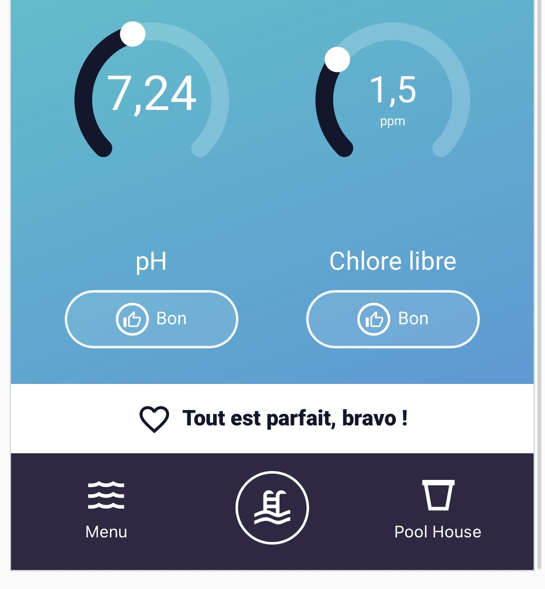 |

| Contrôle des équipements | Volet et auxiliaires |
|---|---|
| 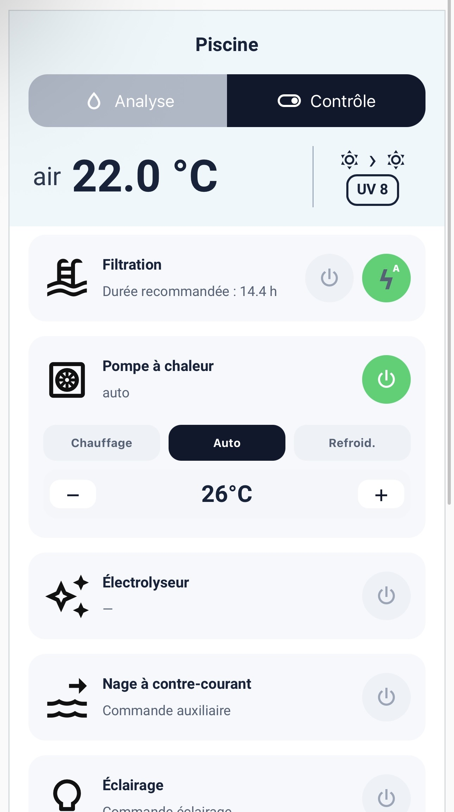 | 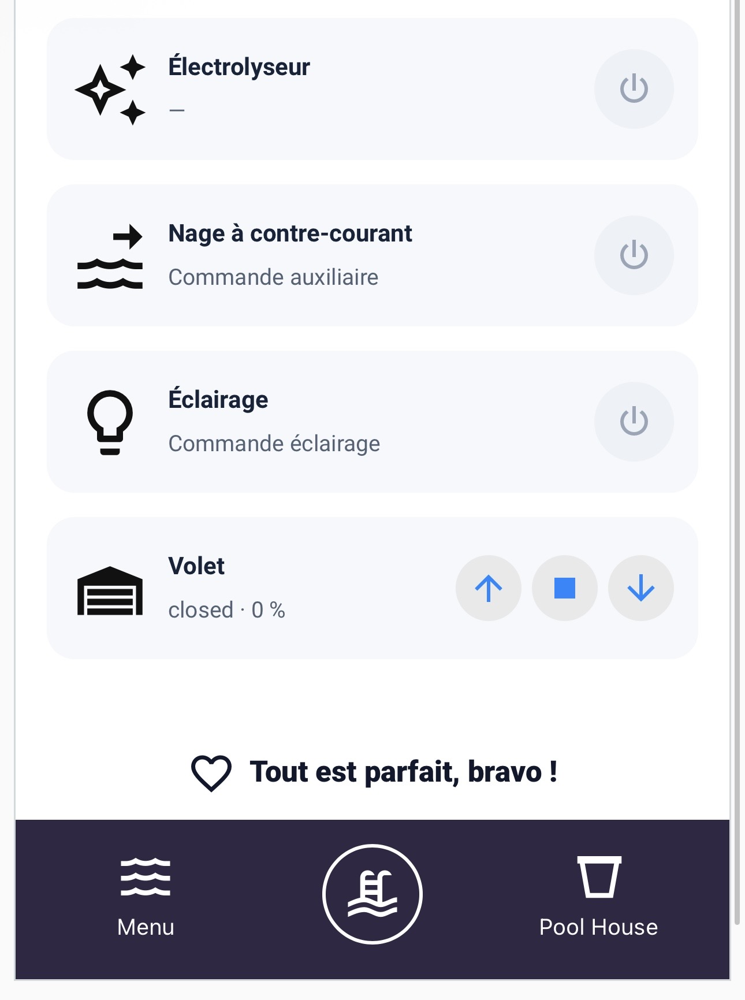 |

| Historique | Pool House |
|---|---|
| 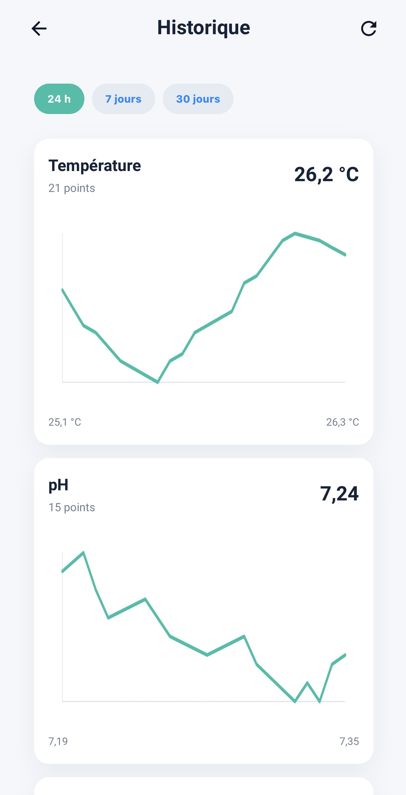 | 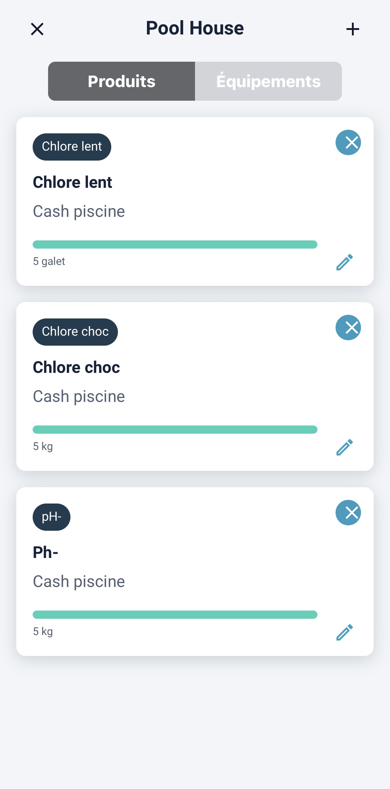 |

| Mode Expert | Équilibre chimique |
|---|---|
| 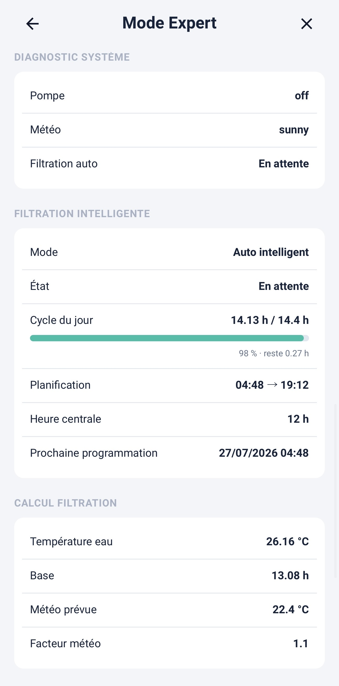 | 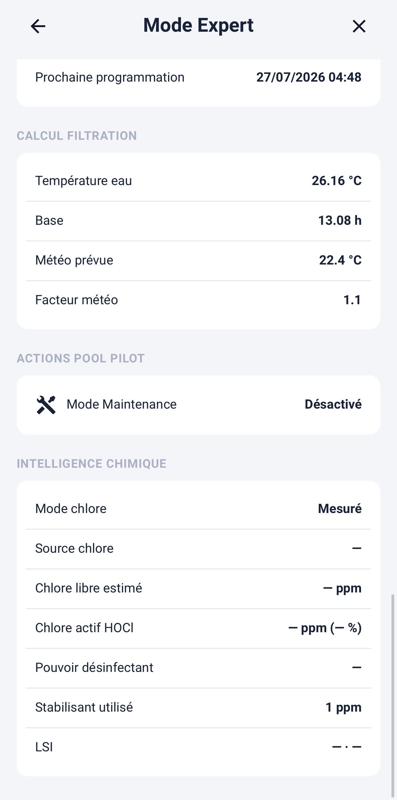 |

| Test bandelette | Balance de Taylor |
|---|---|
| 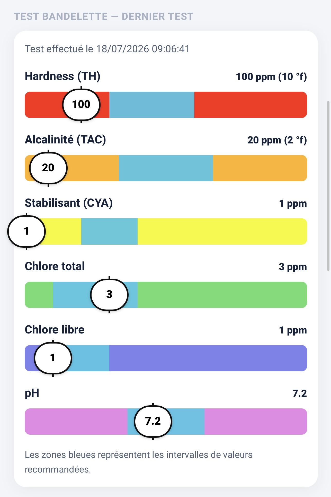 | 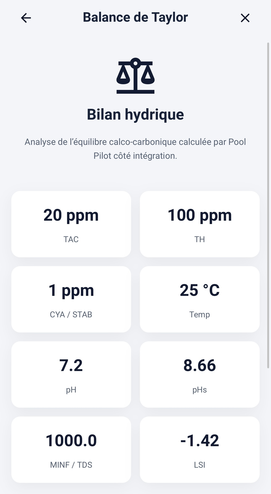 |

## Prérequis

- Home Assistant avec les tableaux de bord Lovelace.
- L’intégration [Pool Pilot](https://github.com/amery74/ha-poolpilot) v1.2.3 ou plus récente.
- HACS recommandé pour l’installation et les mises à jour.

## Installation avec HACS

### Dépôt personnalisé

Tant que le référencement officiel dans HACS n’est pas validé :

1. Ouvrir **HACS**.
2. Aller dans **Tableaux de bord** puis **Dépôts personnalisés**.
3. Ajouter :

```text
https://github.com/amery74/pool-pilot-dashboard
```

4. Sélectionner la catégorie **Tableau de bord / Plugin**.
5. Installer **Pool Pilot Dashboard**.
6. Recharger les ressources Lovelace ou redémarrer Home Assistant.

HACS doit créer automatiquement la ressource :

```text
/hacsfiles/pool-pilot-dashboard/pool-pilot-dashboard-card.js
```

avec le type **Module JavaScript**.

## Installation manuelle

Copier `pool-pilot-dashboard-card.js` dans le dossier :

```text
/config/www/pool-pilot-dashboard/
```

puis ajouter la ressource :

```text
/local/pool-pilot-dashboard/pool-pilot-dashboard-card.js
```

Type : **Module JavaScript**.

## Ajout de la carte

Depuis le tableau de bord Home Assistant :

1. passer en mode édition ;
2. ajouter une carte ;
3. rechercher **Pool Pilot Dashboard** ;
4. sélectionner les entités dans l’éditeur graphique.

Exemple minimal :

```yaml
type: custom:pool-pilot-dashboard-card
pool_name: Piscine
```

L’éditeur permet ensuite d’associer les entités Pool Pilot et les équipements facultatifs.

## Configuration du volet

Le volet ne fait pas partie de l’intégration Pool Pilot. Il est directement associé à la carte à partir de n’importe quelle entité Home Assistant du domaine `cover`.

Dans l’éditeur de la carte :

- activer l’affichage du volet ;
- sélectionner l’entité `cover` ;
- activer éventuellement les confirmations avant ouverture ou fermeture.

La carte appelle directement les services standards :

- `cover.open_cover` ;
- `cover.stop_cover` ;
- `cover.close_cover`.

## Sections de la carte

### Accueil

Affiche les informations essentielles du bassin, l’état des mesures et les alertes prioritaires.

### Contrôle

Regroupe les commandes des équipements configurés. Aucun emplacement n’est affiché pour un équipement absent.

### Historique

Affiche les mesures disponibles sur 24 heures, 7 jours ou 30 jours.

### Pool House

Permet de consulter et gérer les produits, quantités et niveaux de stock.

### Mode Expert

Présente le diagnostic système, le calcul de filtration, la progression du cycle quotidien, les données chimiques et le Mode Maintenance.

### Test bandelette et Taylor

Permet de saisir les mesures manuelles et d’interpréter l’équilibre de l’eau à partir du TAC, TH, stabilisant, pH et de la température.

## Paramètres

Les réglages de filtration, objectifs de qualité de l’eau, seuils d’alerte et notifications sont accessibles depuis la carte lorsqu’ils sont exposés par l’intégration.

<p align="center">
  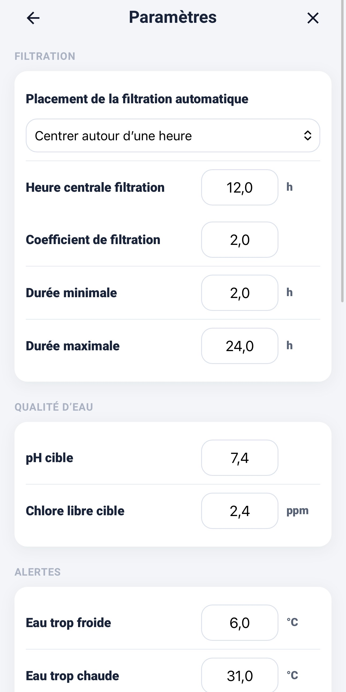
  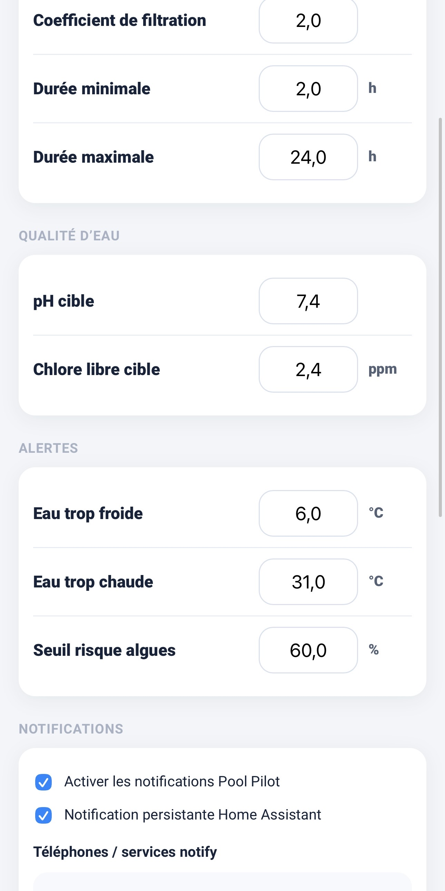
</p>

## Dépannage

### La carte n’apparaît pas

Vérifier dans **Paramètres → Tableaux de bord → Ressources** que l’URL suivante est présente :

```text
/hacsfiles/pool-pilot-dashboard/pool-pilot-dashboard-card.js
```

Le type doit être **Module JavaScript**.

### Une ancienne version reste affichée

- recharger complètement le navigateur ;
- fermer puis rouvrir l’application Home Assistant ;
- vider le cache si nécessaire ;
- vérifier que le fichier du dossier HACS correspond à la version installée.

Le nom exact de la carte est :

```yaml
type: custom:pool-pilot-dashboard-card
```

## Versions

- Pool Pilot Dashboard : **v1.2.3**
- Intégration Pool Pilot recommandée : **v1.2.3** ou plus récente

## Contribution et support

- Problèmes et demandes : [GitHub Issues](https://github.com/amery74/pool-pilot-dashboard/issues)
- Consignes de contribution : [CONTRIBUTING.md](CONTRIBUTING.md)
- Support : [SUPPORT.md](SUPPORT.md)
- Sécurité : [SECURITY.md](SECURITY.md)

## Licence

Pool Pilot Dashboard est distribué sous la licence indiquée dans le fichier [LICENSE](LICENSE).
