<p align="center">
  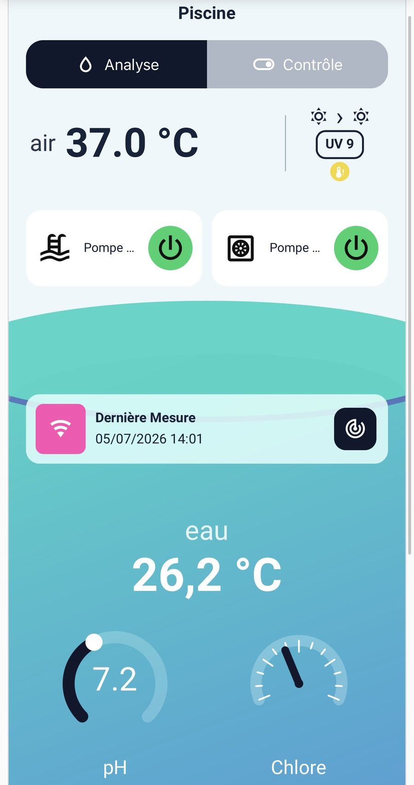
</p>

# Pool Pilot Dashboard

**Pool Pilot Dashboard** est une carte Lovelace complète pour piloter et visualiser une piscine avec Home Assistant et l’intégration Pool Pilot.

Elle regroupe dans une interface mobile : mesures, filtration, chauffage, alertes, conseils, carnet d’entretien, test bandelette, Pool House, balance de Taylor et paramètres avancés.

### Programmation de la filtration depuis la carte

À partir de **v1.2.1-beta**, le panneau **Paramètres → Filtration** permet de piloter directement :

- le placement de la filtration automatique (centré ou plage horaire) ;
- l’heure centrale lorsque le mode centré est utilisé ;
- l’heure de début minimale et l’heure de fin maximale lorsque le mode plage horaire est utilisé.

Les contrôles utilisent les entités `select`, `number` et `time` exposées par Pool Pilot **v1.2.1-beta**.

## Aperçu

<p align="center">
  
  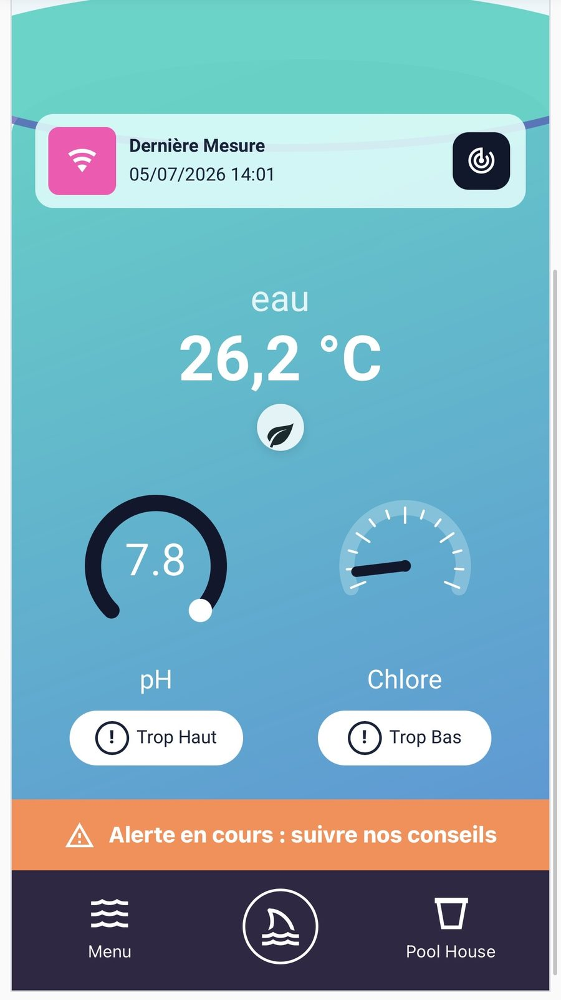
</p>

## Fonctionnalités

- Vue principale piscine avec température, pH, chlore et état global.
- Contrôle de la filtration et de la pompe à chaleur.
- Mode expert avec détails du calcul de filtration.
- Alertes Pool Pilot avec conseils étape par étape.
- Pool House avec stock, seuils et suivi des produits.
- Test bandelette avec formulaire, historique et affichage visuel.
- Balance de Taylor avec LSI, pHs, minF et interprétation.
- Carnet d’entretien et données brutes.
- Configuration graphique via l’éditeur Lovelace.
- Notifications Pool Pilot depuis la carte.
- Compatible mobile et application Home Assistant.

## Captures

| Vue piscine | Conseils alerte | Contrôles |
|---|---|---|
|  | 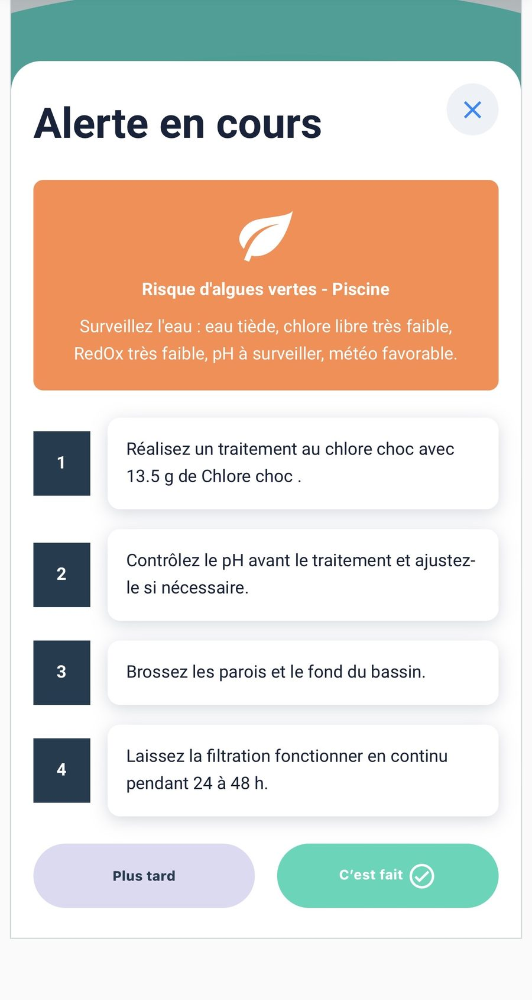 | 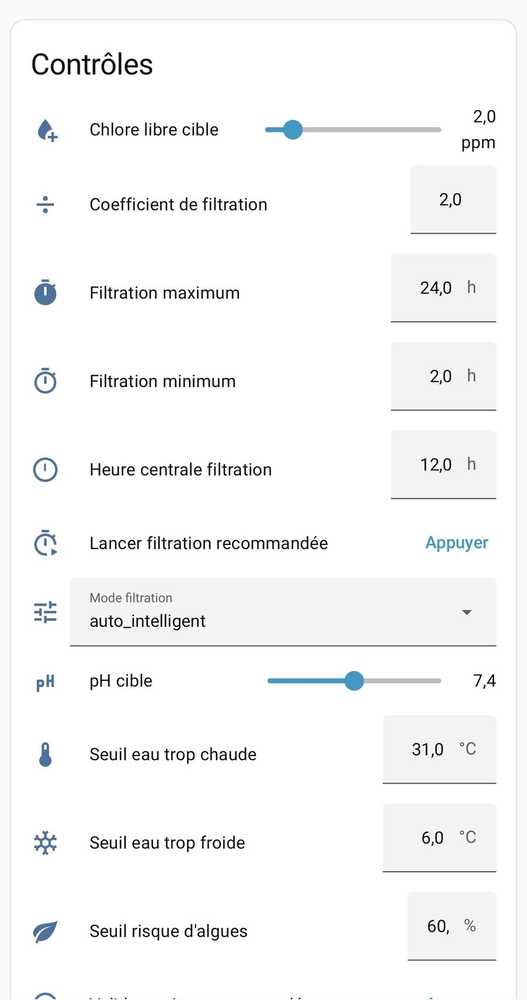 |

| Test bandelette | Résultat bandelette | Balance de Taylor |
|---|---|---|
| 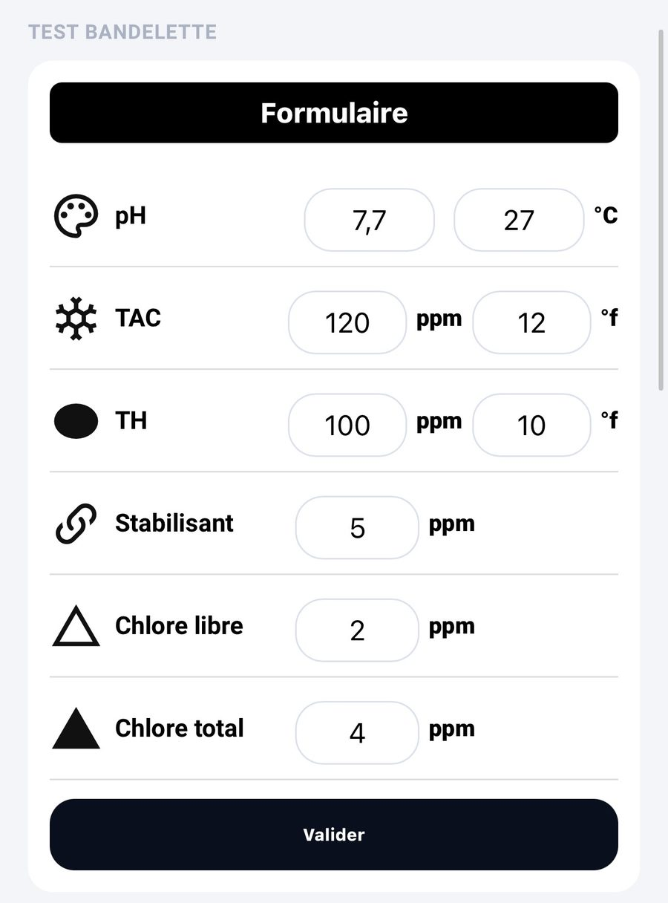 | 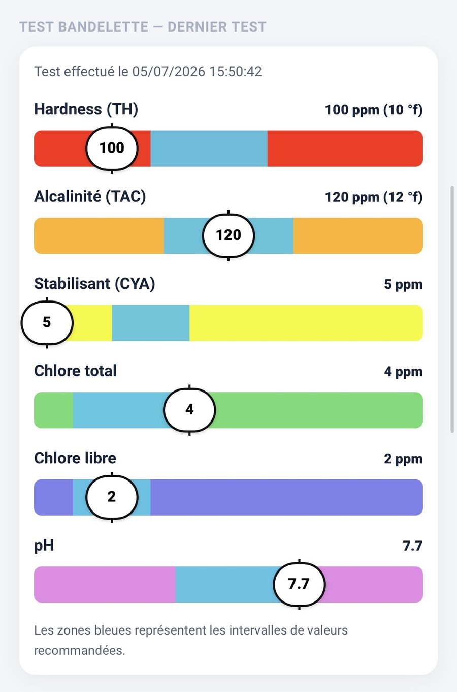 | 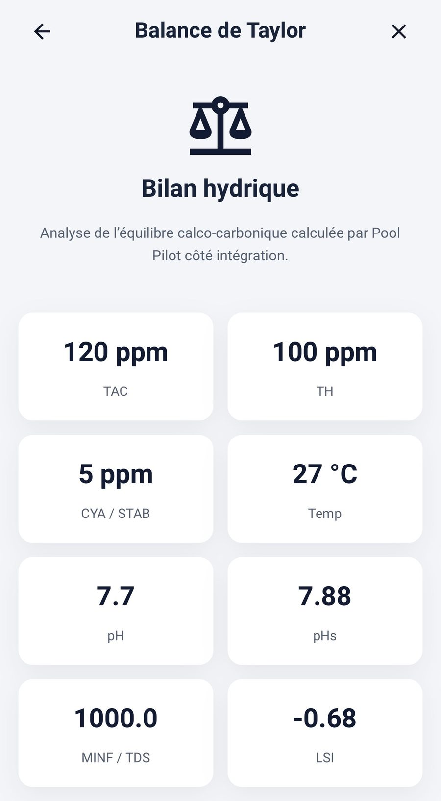 |

| Pool House | Mode expert | Notifications |
|---|---|---|
| 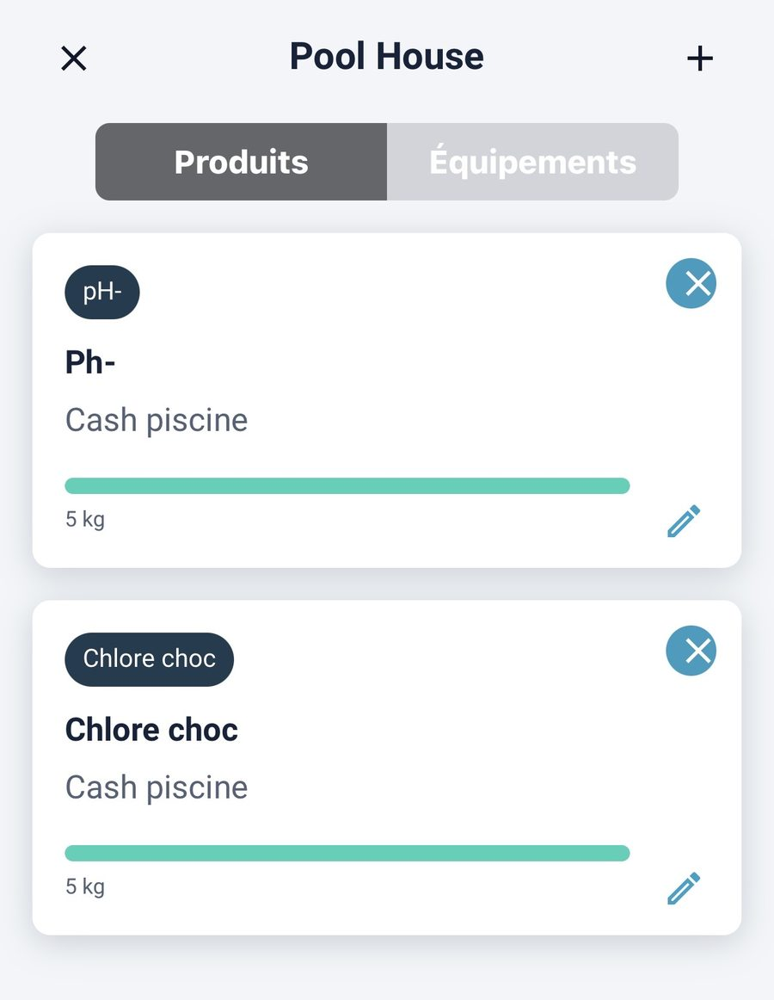 | 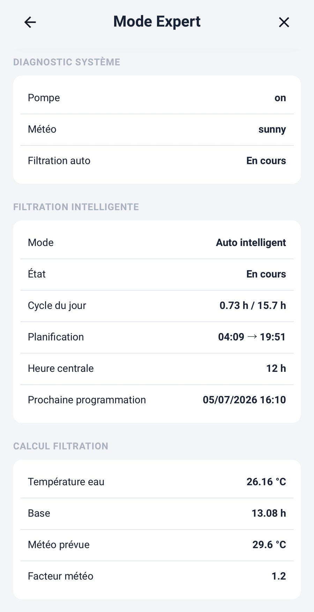 | 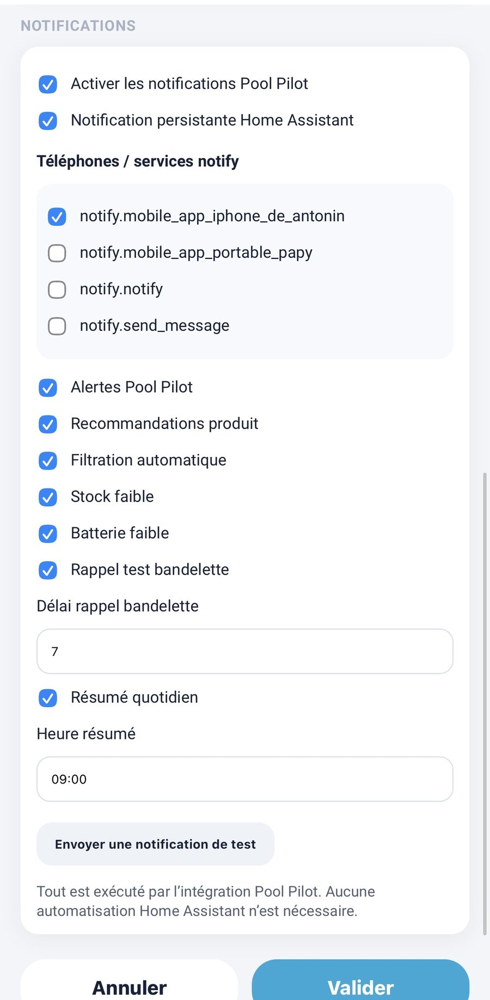 |

## Installation via HACS

1. Ouvrir **HACS**.
2. Aller dans **Dépôts personnalisés**.
3. Ajouter le dépôt :

```text
https://github.com/amery74/pool-pilot-dashboard
```

4. Choisir le type **Tableau de bord / Plugin**.
5. Installer **Pool Pilot Dashboard**.
6. Redémarrer Home Assistant ou recharger les ressources Lovelace.
7. Ajouter une carte personnalisée dans votre tableau de bord.

## Exemple minimal

```yaml
type: custom:pool-pilot-dashboard-card
pool_name: Piscine
```

La carte détecte automatiquement de nombreuses entités Pool Pilot si leurs noms suivent la configuration standard.

## Configuration recommandée

Dans l’éditeur visuel de la carte, renseignez en priorité : température de l’eau, pH, chlore ou chlore estimé, switch filtration, switch filtration intelligente Pool Pilot, durée de filtration recommandée, état filtration intelligente, alertes Pool Pilot, test bandelette, carnet d’entretien, Pool House et balance de Taylor.

<p align="center">
  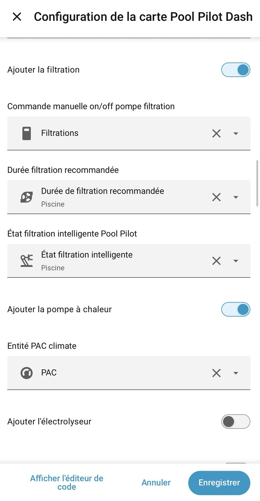
  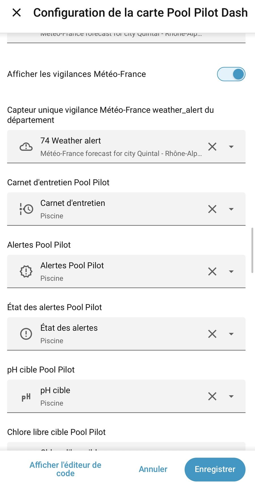
</p>

## Sections de la carte

### Vue principale

Affiche les informations essentielles : température de l’eau, pH, chlore, dernière mesure, état d’alerte et accès aux actions rapides.

### Mode expert

Présente la pompe, la météo, la filtration automatique, le cycle du jour, la planification, le calcul de filtration et le facteur météo.

### Pool House

Permet de suivre les produits, leur stock et les recommandations d’utilisation.

### Test bandelette

Propose une saisie simple des valeurs bandelette et un affichage visuel du dernier test.

### Balance de Taylor

Affiche les indicateurs d’équilibre de l’eau : TAC, TH, CYA, température, pH, pHs, minF et LSI.

## Ressources Lovelace

HACS ajoute normalement la ressource automatiquement. Si nécessaire, ajoutez manuellement :

```text
/hacsfiles/pool-pilot-dashboard/pool-pilot-dashboard-card.js
```

Type : **JavaScript module**.

## Dépannage

Si la carte ne se met pas à jour après installation : vider le cache du navigateur ou de l’application mobile, vérifier la ressource Lovelace, redémarrer Home Assistant, puis vérifier les logs navigateur et Home Assistant.

## Versions recommandées

- Pool Pilot Dashboard : **v1.0.0** ou plus récent.
- Pool Pilot : **v1.0.0** ou plus récent.

## Licence

Carte Lovelace personnelle pour Home Assistant et Pool Pilot.


## Nouveautés v1.1.0 bêta

- Valeur numérique du chlore libre (`X,X ppm`) ou de l’ORP (`XXX mV`) sous la jauge.
- Sélecteur d’affichage Chlore / ORP dans l’éditeur visuel.
- Éclairage et deux contacts auxiliaires facultatifs, configurables uniquement dans la carte.
- Les bandeaux d’alerte ne sont plus affichés sans recommandation exploitable.
- Les champs **Lancer une mesure** et **Dernière mesure** restent facultatifs et dépendent des entités exposées par l’appareil.


## Dépannage HACS

Après l’installation, HACS place physiquement les fichiers dans :

```text
/config/www/community/pool-pilot-dashboard/
```

Dans Home Assistant, ils sont servis par l’URL virtuelle :

```text
/hacsfiles/pool-pilot-dashboard/pool-pilot-dashboard-card.js
```

Ces deux chemins désignent donc le même fichier.

En cas d’erreur **Custom element doesn't exist: pool-pilot-dashboard-card** :

1. Ouvrez **Paramètres → Tableaux de bord → Ressources**.
2. Vérifiez la présence de :
   `/hacsfiles/pool-pilot-dashboard/pool-pilot-dashboard-card.js`
3. Le type doit être **Module JavaScript**.
4. Si la ressource manque, ajoutez-la manuellement.
5. Rechargez complètement le navigateur ou l’application Home Assistant.

Le nom correct de la carte est :

```yaml
type: custom:pool-pilot-dashboard-card
```

